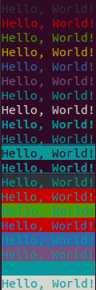

# 终端字符显示颜色(不支持Windows平台)

为你的输出便捷的添加颜色
```c++
// 输出绿色Hello, World!
std::cout << "Hello, World!"_green << std::endl;
// 输出带下划线的蓝色Hello, World!
std::cout << "Hello, World!"_blue.underline() << std::endl;
// 输出粗体的红色Hello, World!
std::cout << "Hello, World!"_red.highlight() << std::endl;
// 输出背景为红色，字符为蓝色的Hello, World!
std::cout << "Hello, World!"_blue.back(ColorCode::red).highlight() << std::endl;
// 输出背景为黄色，字符不设置颜色
std::cout << "Hello, World!"_c.back(ColorCode::yellow) << std::endl;
```

实现以上功能，只需要一个头文件，然后使用命名空间即可（需要C++17支持）
```c++ 
#include "TerminalColor.hpp"
using namespace tc;
```



---

具体支持的字符颜色和样式，详见头文件源码。
